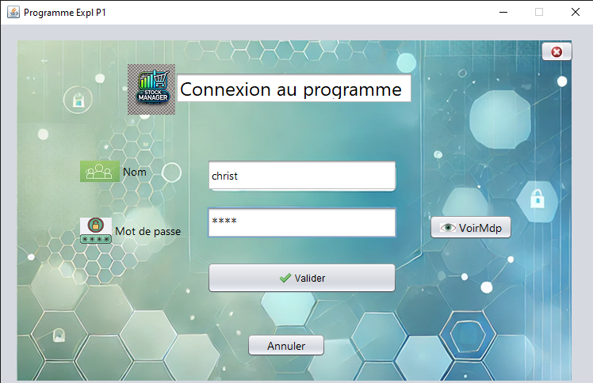
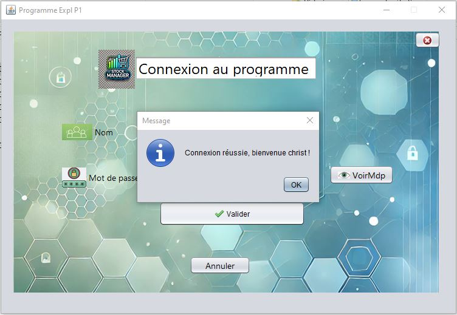
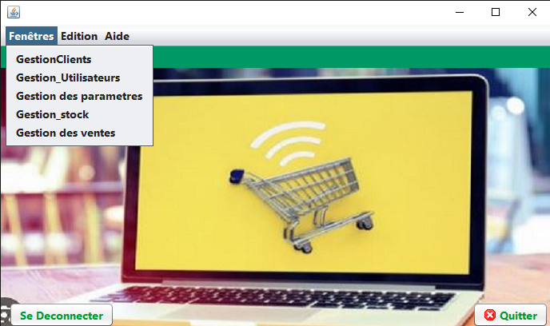
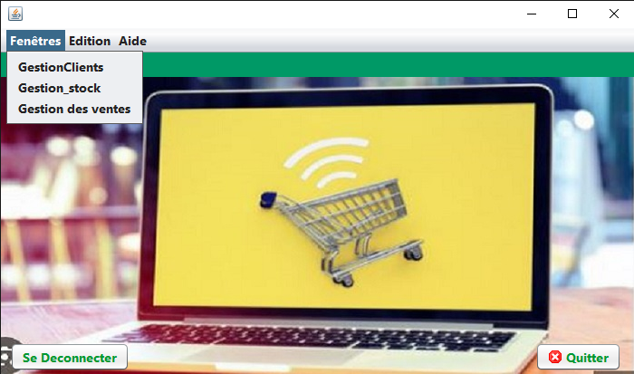
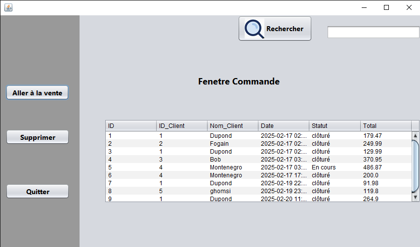
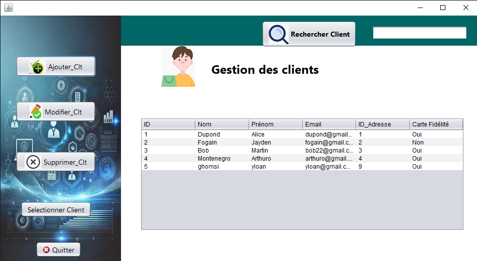
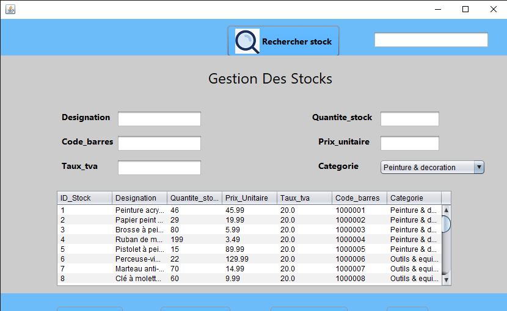
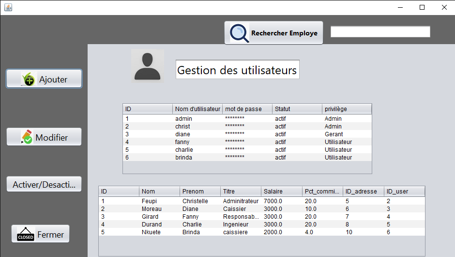
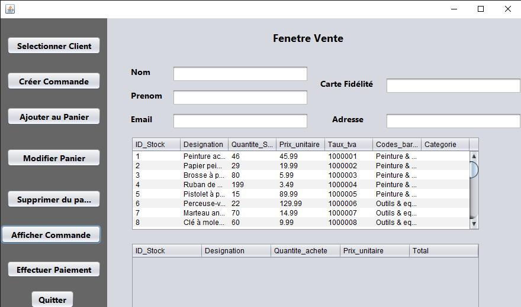

# Application de Gestion de Stock avec Base de Données - Java Swing & SGBD

Projet réalisé dans le cadre du module de **Projet de Developpement SGBD**.

## 🎯 Objectif
Développer une application de gestion de stock avec interface graphique en **Java Swing** connectée à une base de données via **NetBeans**,
 L'application permet : 

-Gestion des clients
- Gestion des utilisateurs (avec différents privilèges)
- Gestion des stocks
- Gestion des ventes et commandes
- Gestion des paramètres de connexion à la base de données

## 🛠️ Technologies utilisées

- Java Swing (interface graphique)
- Connexion JDBC
- Base de données MySQL
- iText pour la génération de factures PDF
- NetBeans IDE
- JBCrypt pour cryptage de mot de passe

## ▶️ Fonctionnalités principales

- Authentification utilisateur
- CRUD clients/articles/commandes
- Génération de factures PDF
- Interface utilisateur intuitive
- Connexion sécurisée à la base de données

## 🧩 Architecture
- **Controle** : gestion des actions utilisateur
- **Images** : ressources graphiques
- **Modele** : classes métiers (Client, Stock, Commande, etc.)
- **Ressources** : fichiers de configuration
- **Utils** : utilitaires (génération PDF)
- **Vue** : fenêtres graphiques

## 📸 Aperçu de l'application
- Connexion utilisateur
- Tableau de gestion des clients
- Interface de gestion des utilisateurs
- Gestion du stock
- Gestion des ventes

## 🧪 Capture d’écran

     ## 🧪Authentification

    ## 🧪Fenêtre admin

    ## 🧪fenetre gerant

    ## 🧪fenetre consultant

    ## 🧪fenetre commande

    ## 🧪Gestion clients

    ## 🧪Gestion des parametres

    ## 🧪Gestion du stock

    ## 🧪Gestion des utilisateurs

    ## 🧪Gestion des ventes

## 🔧 Lancer le projet

1. Ouvrir le projet avec **NetBeans**.
2. S'assurer que le **serveur MySQL** est en marche.
3. Importer le script SQL : charger sur le  Serveur MySQL/MariaDB  la base de données `Gestion_stock`
4. Modifier les informations de connexion dans `Configuration.java` si nécessaire.
5. Connexion internet pour téléchargement éventuel des librairies (iText, JDBC drivers)
6. Exécuter le fichier `FenetreConnexion.java`.

## 💡 Informations importantes
- Les privilèges limitent les fonctionnalités accessibles aux utilisateurs.
- Les commandes peuvent être modifiées tant qu'elles ne sont pas clôturées.

## 💡 Auteur

- **Feupi Nkuete Christelle Brinda**
